---

# {{site.data.about.title}}
{{site.data.about.authors}}







## {{entry[0]}}




    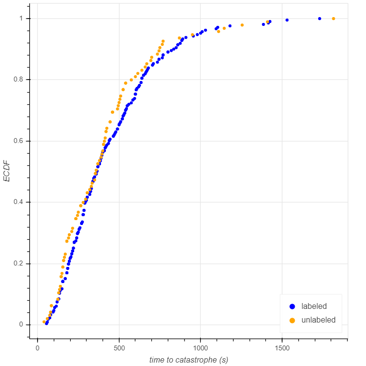
    <figcaption> ECDFs of Time to Catastrophe for Labeled vs Unlabeled Tubulin </figcaption>





    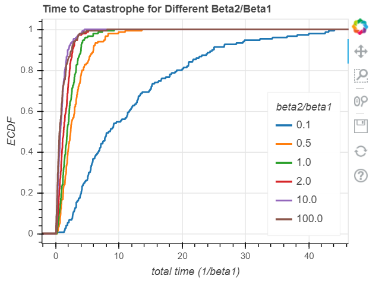
    <figcaption> ECDFs of Time to Catastrophe with Different b2/b1 ratios </figcaption>





    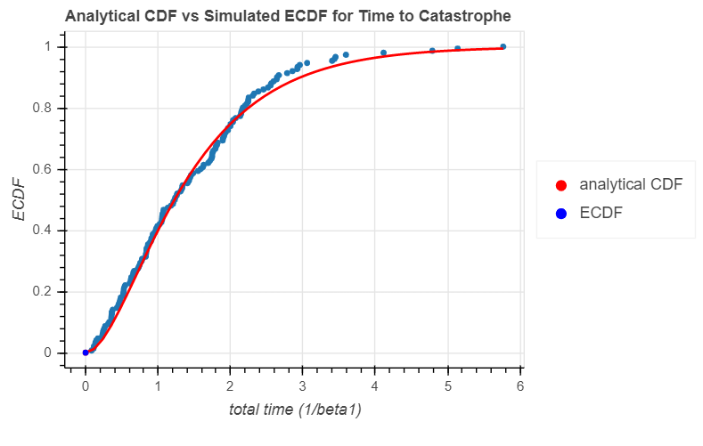
    <figcaption> Analytical vs Simulated ECDF of Time to Catastrophe </figcaption>





    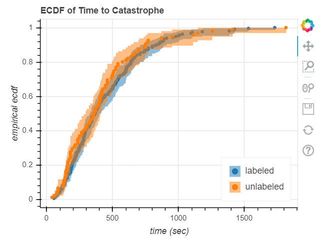
    <figcaption> ECDF of Time to Catastrophe for Labeled vs Unlabeled Tubulin, with Confidence Intervals </figcaption>





    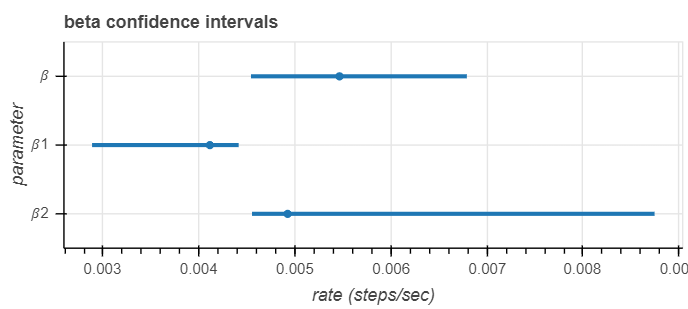
    <figcaption> Confidence Intervals for Rates, Both Models </figcaption>





    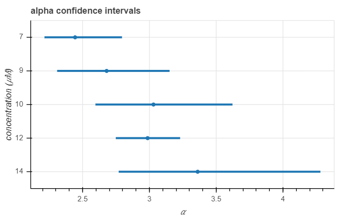
    <figcaption> Confidence Intervals for Alpha at Different Concentrations, Gamma Model </figcaption>





    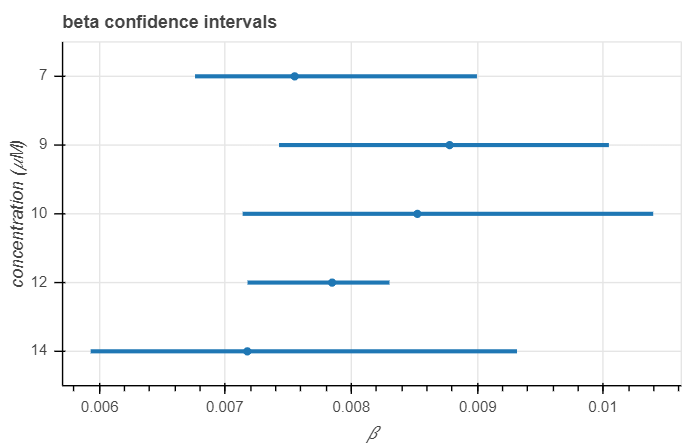
    <figcaption> Confidence Intervals for Beta at Different Concentrations, Gamma Model </figcaption>





    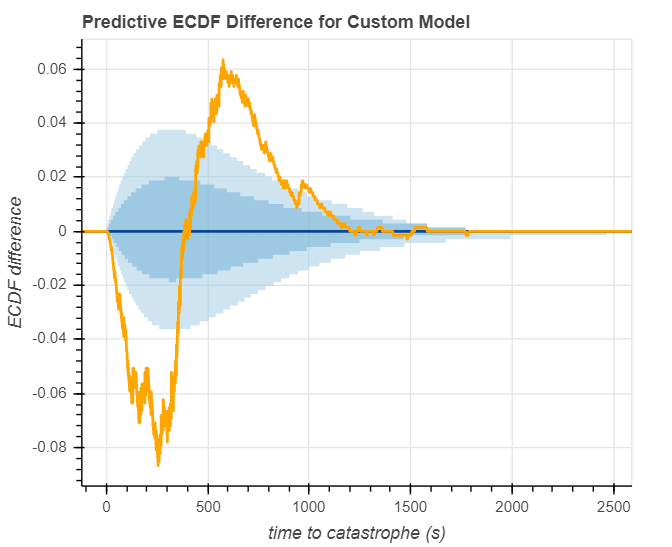
    <figcaption> Predictive ECDF Differences, Custom Model </figcaption>





    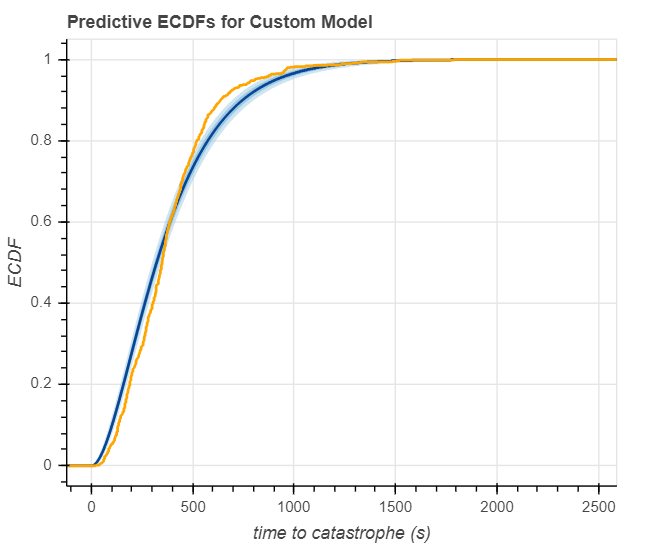
    <figcaption> Predictive ECDFs, Custom Model </figcaption>





    

        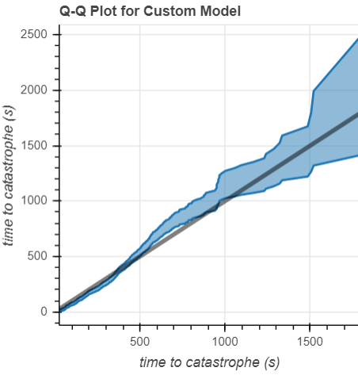
        <figcaption style="text-align:center;"> QQ Plot, Custom Model </figcaption>
    

    

        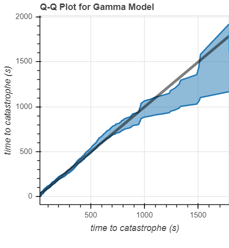
        <figcaption style="text-align:center;"> QQ Plot, Gamma Model </figcaption>
    





    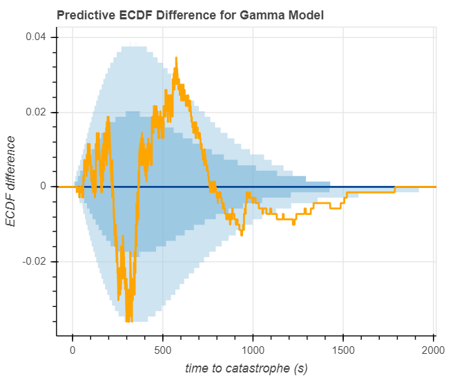
    <figcaption> Predictive ECDF Difference, Gamma Model </figcaption>





    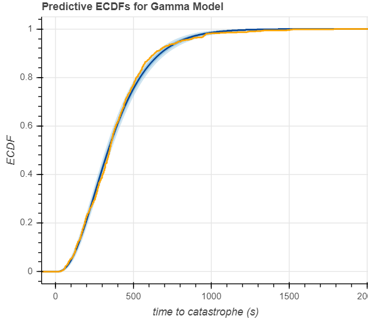
    <figcaption> Predictive ECDFs, Gamma Model </figcaption>



{{entry[1]}}



